## Pardus Kurulum Rehberi

Bu çalışmada birlikte Pardus kuracağız. Pardus yüklemek isteyen biri genellikle iki seçenekle karşılaşır:

* **Bilgisayarında yalnızca Pardus kullanmak**
  (Ki bize göre en temiz, en keyifli seçenek — şiddetle öneririz! 😄)

* **Birden fazla işletim sistemini aynı bilgisayarda kullanmak**
  (Yani hibrit / çift işletim sistemi kurulumu.)

### ⚠️ Son Bir Uyarı

Kurulum işlemi sonunda bilgisayarınızdaki tüm veriler silinebilir. Bu nedenle başlamadan önce önemli dosyalarınızı mutlaka yedekleyin.

---

## Kurulum İçin Hazırlık

Pardus’u kurabilmek için önce kurulum dosyalarını bilgisayarınızın diskine yazmanız gerekir. Kulağa teknik geliyor olabilir ama düşündüğünüzden çok daha kolay bir süreç sizi bekliyor.

Eskiden kurulumlar optik disklerle yapılırdı—CD tak, dua et, bekle… (plug and pray 🙂). Günümüzde çoğu bilgisayarda optik sürücü bile olmadığı için USB belleğimizi **önyüklenebilir (bootable)** hale getirmemiz gerekiyor. Kısacası bilgisayarımıza “Lütfen bu USB’den başlat.” demiş oluyoruz.

### İhtiyacımız Olan Üç Şey

1. **Pardus Disk Kalıbı (ISO)**
   Pardus kurulum dosyaları `.iso` uzantılı bir dosya olarak sunulur. Bu dosyayı Pardus’un resmi web sitesinden güvenle indirebilirsiniz.

2. **USB Bellek**
   En az 8 GB kapasiteli bir USB bellek gerekiyor. Ancak dikkat: Bu işlem sırasında bellekteki tüm veriler silinir. Eğer içinde önemli bir şey varsa mutlaka yedekleyin—yoksa “fotoğraflarım nerde?” paniğine girilebilir. 😄

3. **Önyüklenebilir Oluşturucu Araç**
   USB belleği önyüklenebilir hale getirmek için birçok yöntem var. Ancak en pratik olanı, bu işi bizim yerimize yapan yardımcı araçları kullanmak.

**Windows kullanıcıları için:**

* Rufus
* Ventoy

**Linux kullanıcıları için:**

* Pardus Disk Kalıbı Yazıcı
* Ventoy (Kendisi çok yönlü bir arkadaş! 😄)

Bu rehberde Windows kullanıcıları için **Rufus**, Linux kullanıcıları için **Pardus Disk Kalıbı Yazıcı** adım adım anlatılacaktır.

---

## Windows İçin: Rufus

Programı `https://rufus.ie/tr/#download` adresinden indirebilirsiniz. Taşınabilir (portable) sürümü seçerseniz kurulum yapmadan direkt çalıştırabilirsiniz.
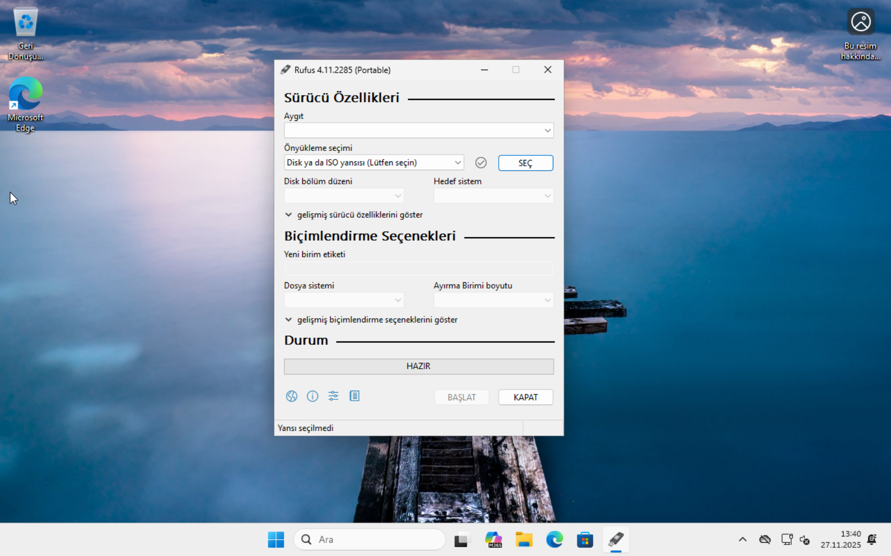
### USB Hazırlama Adımları

1. **Aygıt Seçimi**
   USB belleğinizi seçin. Dikkat: Seçtiğiniz bellekteki tüm içerik silinecek.

2. **Önyükleme Seçimi**
   “Disk ya da ISO yansısı” seçeneğini seçip “Seç” butonuyla Pardus ISO dosyasını gösterin.

3. **Disk Oluşturma**
   Her şey hazırsa “Başlat”a tıklayın. Gelen uyarıları onaylayın ve işlemin tamamlanmasını bekleyin. Donanımınıza göre birkaç dakika sürebilir.

---

## Linux İçin: Pardus Disk Kalıbı Yazıcı

Bilgisayarınızda zaten Pardus kullanıyorsanız en kolay yöntem, Pardus ile birlikte gelen **Pardus Disk Kalıbı Yazıcı** aracına başvurmaktır.
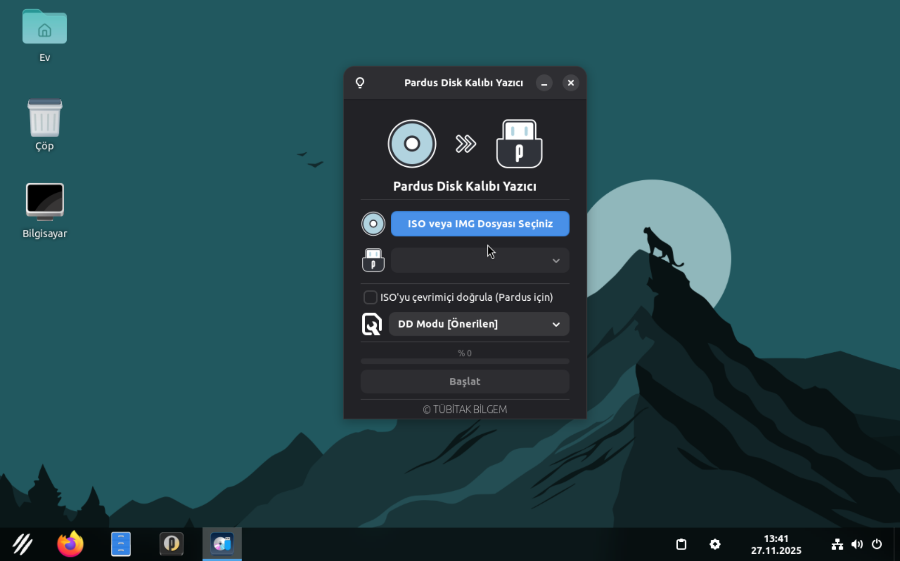
2. **Kalıp Seçimi**
   Programı açıp “ISO veya IMG Dosyası Seçiniz” düğmesine tıklayın ve ISO dosyasını seçin.

2. **USB Aygıtı Seçimi**
   Açılır listeden hedef USB belleğinizi işaretleyin. Yanlış aygıt seçmemek için diğer USB’leri çıkarmanız önerilir.

3. **Başlat**
   “Başlat” düğmesine tıklayın ve işlemin tamamlanmasını bekleyin.

4. **Çalışan Ortam**
   USB’den açtığınızda Pardus’u kurmadan deneyebilirsiniz. Masaüstü açılınca “Pardus Yükle” uygulamasını çalıştırınız.

---

## Pardus Kurulumu

USB belleğiniz hazır olduğuna göre kuruluma geçebiliriz. Önce karar vermeniz gereken önemli bir soru var:

**Bilgisayarınızda yalnızca Pardus mu olacak, yoksa mevcut işletim sisteminizin yanına mı kuracaksınız?**

---

# Yalnızca Pardus Kurulumu

1. Bilgisayarınızı yeniden başlatın.
2. USB’den başlatın (BIOS’tan boot önceliğini değiştirerek veya açılışta Boot Menü tuşuyla).
3. Açılışta dil seçim ekranı gelir.
    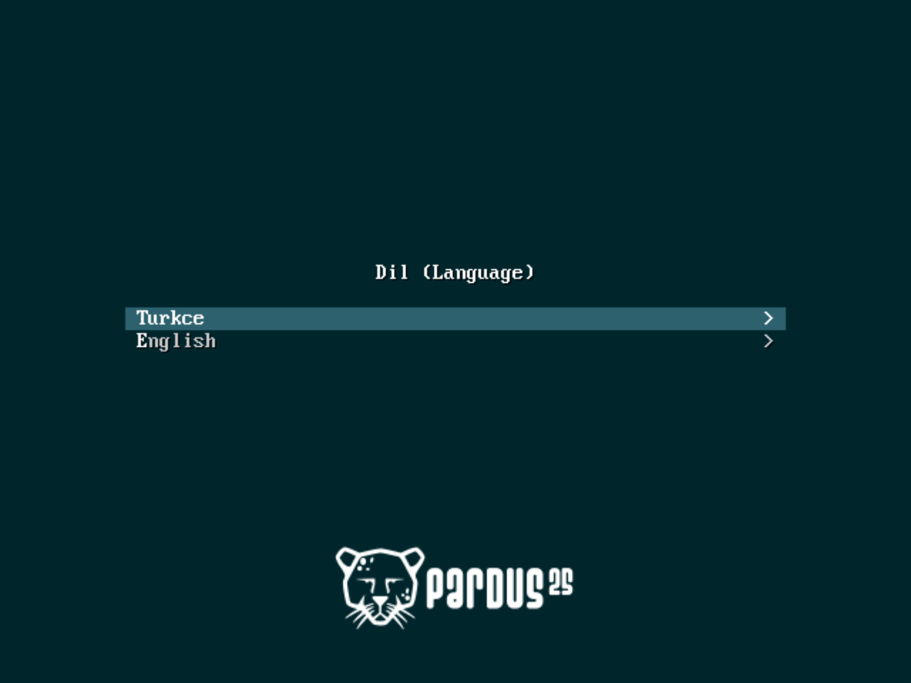
4. “Pardus Çalışan” modunu seçin.
    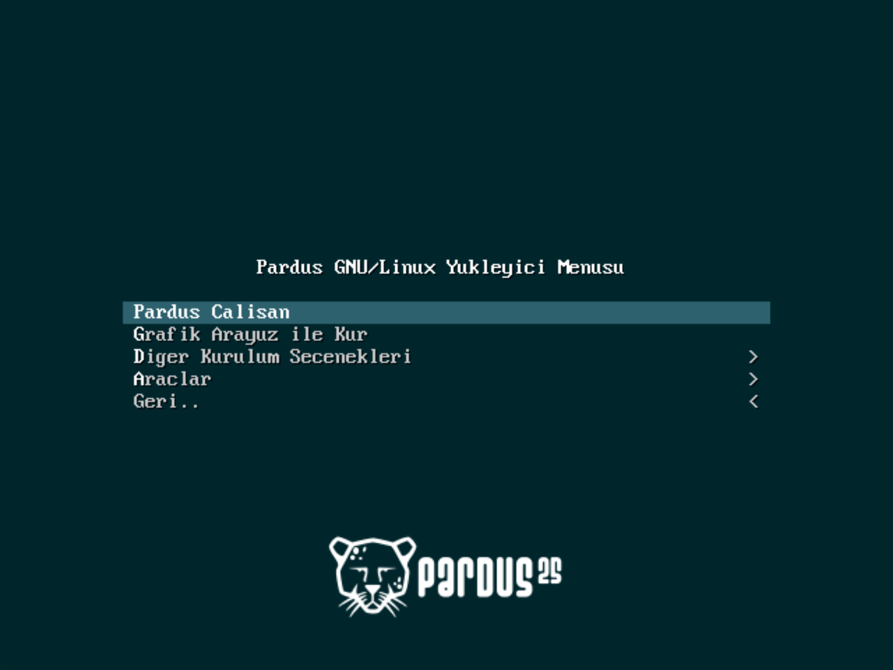
5. Masaüstü gelince “Pardus Yükle” uygulamasını başlatın.
    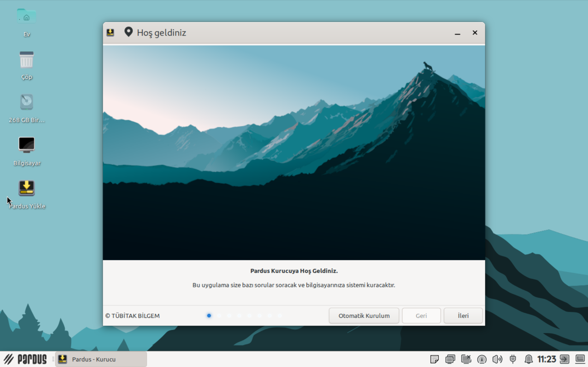
6. Sırasıyla:

   * Dil Seçimi
   * Klavye Düzeni
   * Zaman Dilimi

   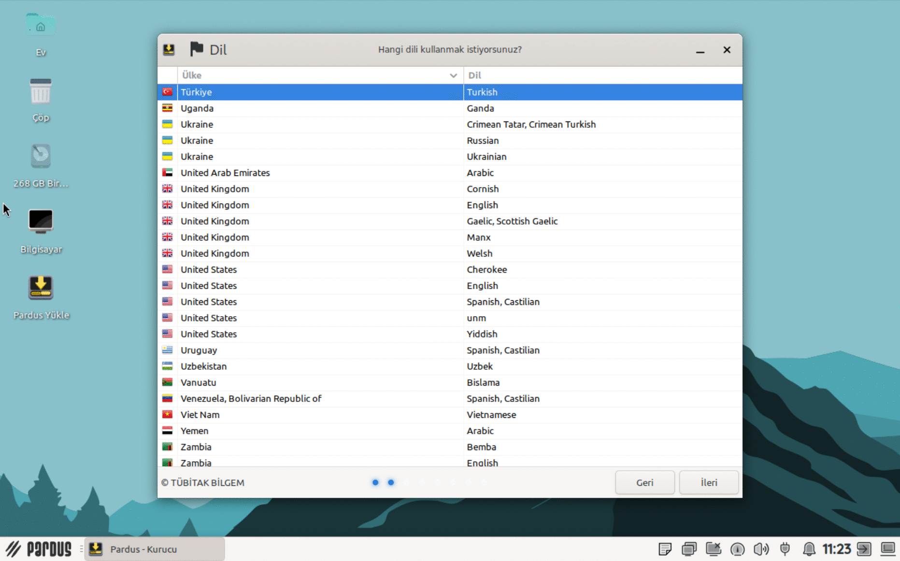

7. **Disk Seçimi**
   Otomatik bölümlendirme seçeneğini kullanırsanız Pardus en uygun yapıyı kendisi oluşturur.
    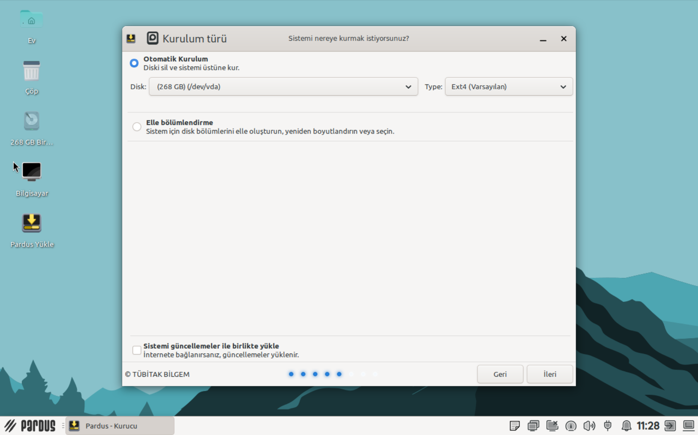
8. **Kullanıcı Bilgileri**
   Ad, bilgisayar adı, kullanıcı adı, şifre.
    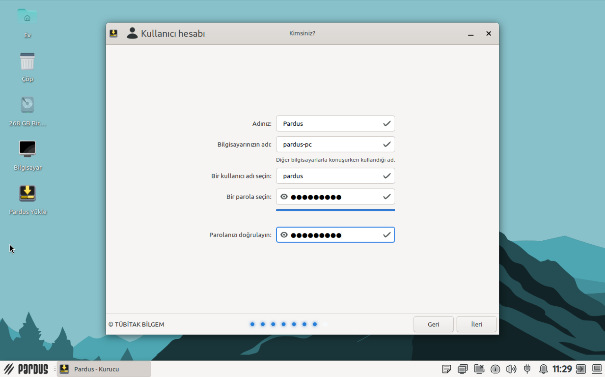
9. **Özet Ekranı**
   Tüm ayarlar gösterilir. “Yükle”ye tıkladığınız anda gerçek işlem başlar (ve veri kaybı bu anda olur).
    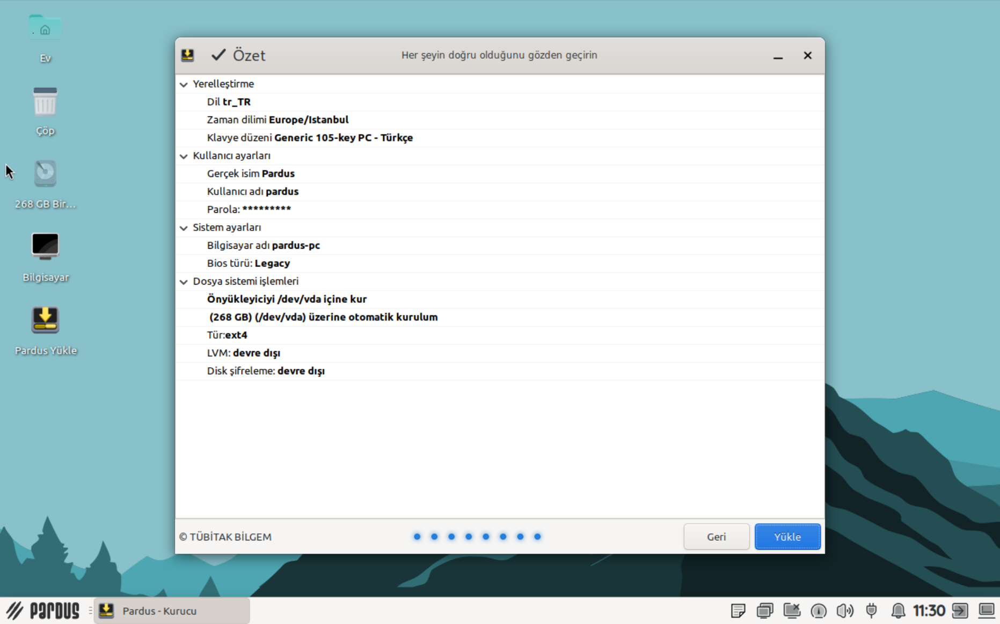

---

# Hibrit Sistem (Çift İşletim Sistemi) Kurulumu

Hibrit sistem, örneğin Windows ve Pardus’un yan yana kurulu olduğu yapıdır. Açılışta hangisini başlatacağınızı siz seçersiniz.

### Dikkat Edilecek Noktalar

1. Aynı anda yalnızca bir işletim sistemi çalışır.
2. Pardus’u yanına kurmak Windows’u yavaşlatmaz.
   (Merak etmeyin, Windows kıskançlık yapmıyor. 😊)

Kurulumun en kritik aşaması disk yönetimidir.

---

## 1) Windows’ta Yer Açma

* **Win + X → Disk Yönetimi**
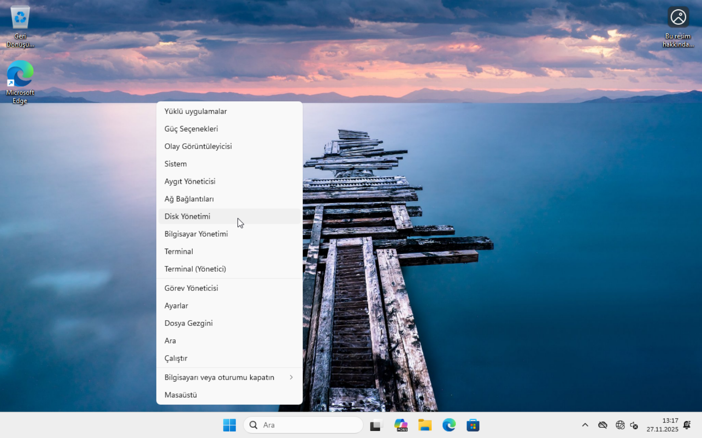
* C: sürücüsüne sağ tıklayıp “Birimi Küçült” seçin.
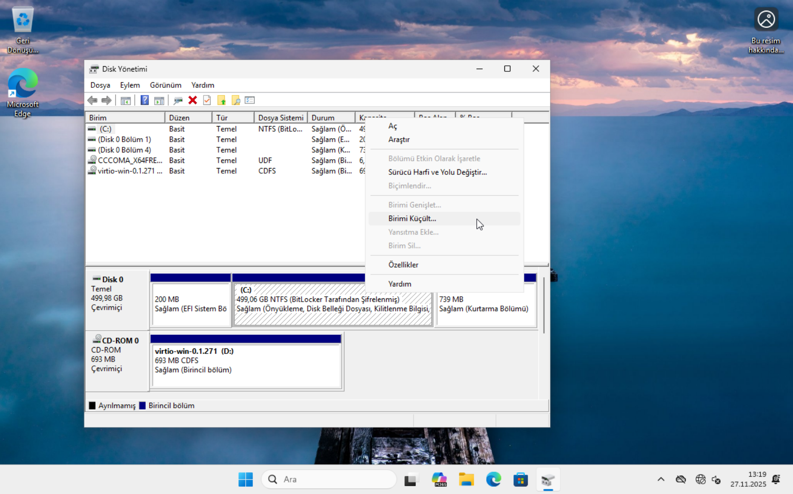
* Pardus için ayırmak istediğiniz alanı MB cinsinden yazın.
  (Önerilen minimum: 20 GB = 20.480 MB)
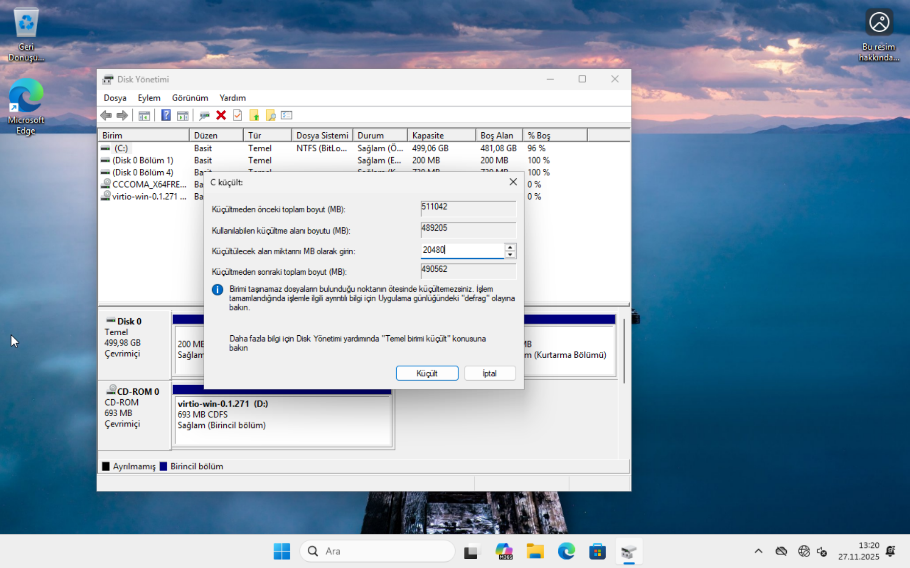
* Küçült’e tıklayın. İşlem tamamlanınca boş alan oluşacaktır.
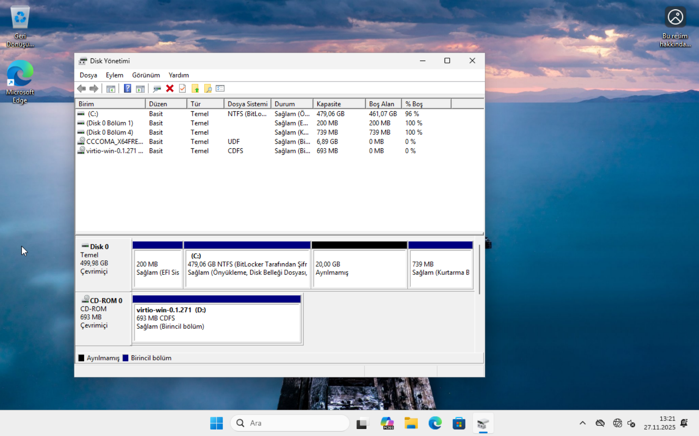
---

## 2) Pardus’u Kurma

USB’den Pardus’u başlatmak için öncelikle mevcut kullanıcı oturumunuzdan çıkış yapın.
Ardından Shift tuşunu basılı tutarak bilgisayarınızı yeniden başlatın.

Açılan ekranda Aygıt kullan → USB Disk seçeneğini işaretleyin.

* Dil
* Klavye
* Zaman Dilimi

ayarlarını yapın.

### 3) Disk Seçimi (En önemli aşama)

“**Elle bölümlendirme**”yi seçin.
Boş alanı bulun → “Oluştur”
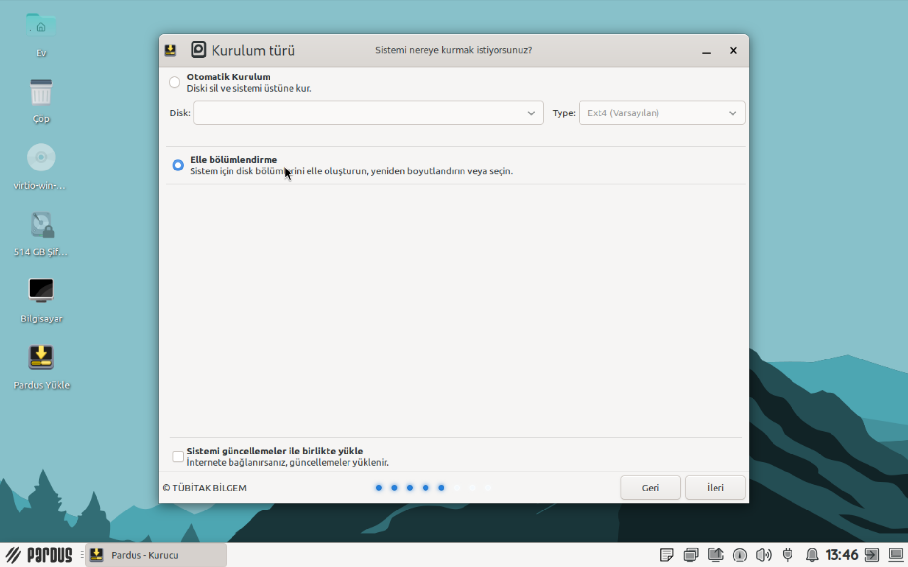
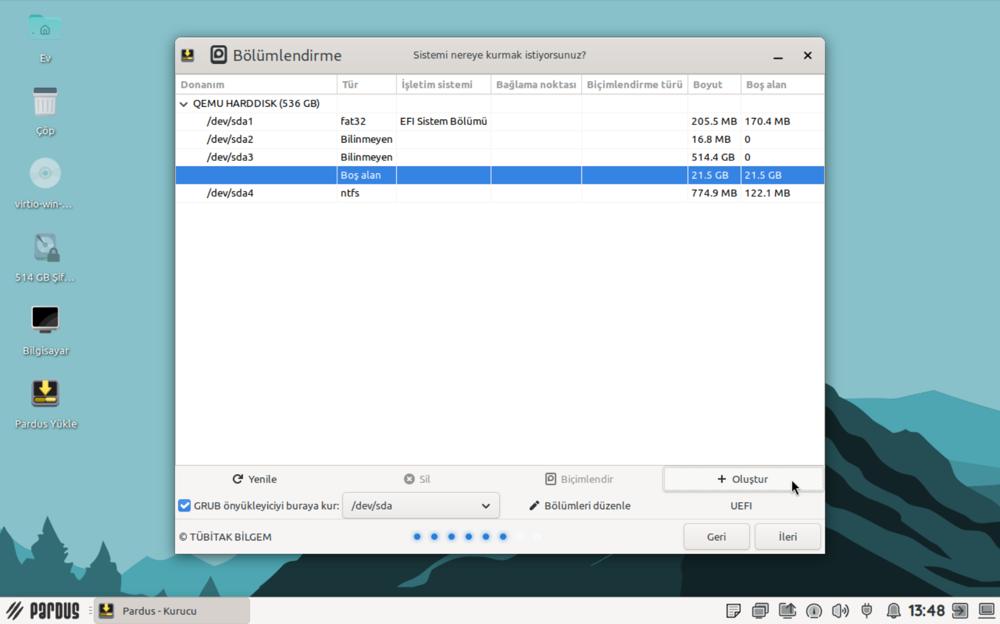
Daha sonra aynı pencerede "Biçimlendir".

Son olarak "ext4" diskine sağ tıklayıp "/ olarak ata" seçeneğine tıklanır
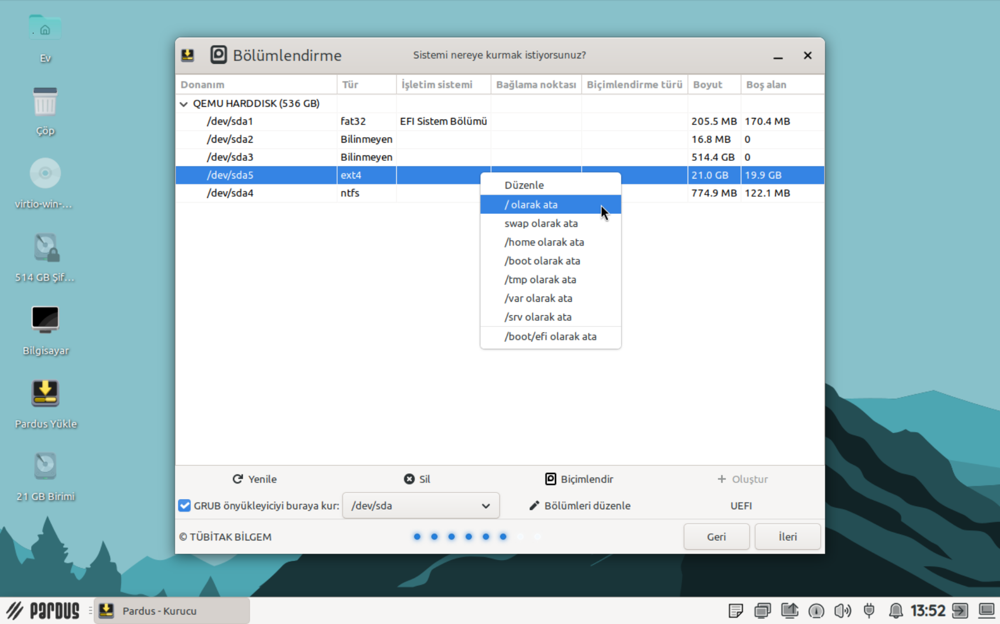
Artık Pardus nereye kurulacağını biliyor.

### 4) Kullanıcı Bilgileri

Ad, bilgisayar adı, kullanıcı adı, şifre.

### 5) Özet Ekranı

Her şey doğruysa “Yükle”ye tıklayın.

---

## Kurulum Sonrası: GRUB Önyükleyici

Bilgisayar her açıldığında GRUB adlı önyükleyici devreye girer ve size şunları sunar:

* Windows
* Pardus

Ok tuşlarıyla istediğinizi seçip başlatabilirsiniz.

(Artık bilgisayarınız iki farklı dünyanın kapısını açıyor!)
